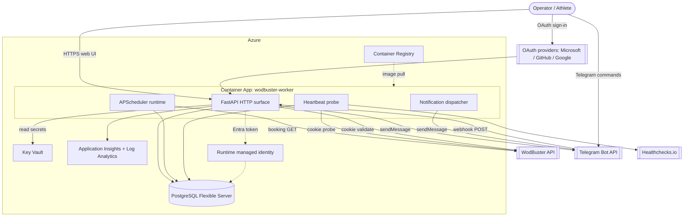
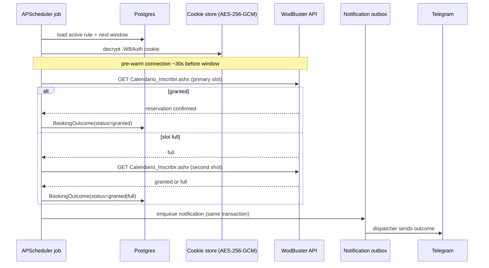
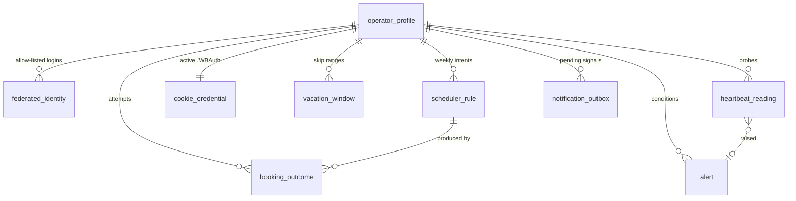
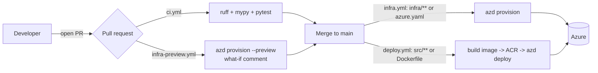

# WodBuster Booking Worker — Developer Guide

Comprehensive, developer-facing reference for the WodBuster Booking Worker: an unattended service that books CrossFit / box classes on the WodBuster platform the instant each booking window opens.

This is the only design document tracked in the public repository. Internal specs, ADRs, envisioning notes, and migration records are intentionally excluded from version control (see `.gitignore`).

## Table of contents

1. [Project architecture](#1-project-architecture)
2. [Getting started](#2-getting-started)
3. [Features and pages](#3-features-and-pages)

---

## 1. Project architecture

### 1.1 What the system does

Popular classes open at a fixed time and fill in under 10 seconds. A human who logs in and clicks manually loses the spot. The worker removes the human from the booking-time critical path: the operator configures recurring rules once, and a background scheduler fires a single pre-warmed HTTP booking request the moment the reservation window opens.

Design principles that shape the whole codebase:

- API-only client. The worker calls WodBuster HTTP handlers directly. No HTML scraping, no headless browser.
- No credential storage. Only the `.WBAuth` session cookie is persisted, encrypted at rest with AES-256-GCM. WodBuster username and password never touch the system.
- No silent failure. Every scheduled run produces a success notification, a failure notification, or a heartbeat anomaly alert. "No notification" is itself an alarm condition.
- Single long-running process. One FastAPI ASGI application hosts the web UI, the Telegram webhook, the APScheduler runtime, and the heartbeat probe together.

### 1.2 Runtime shape

The application is a single FastAPI process running on Azure Container Apps. Inside that process:

| Concern | Component | Location |
|---------|-----------|----------|
| HTTP surface (web UI, OAuth, Telegram webhook) | FastAPI routers | `src/wodbuster_worker/routes`, `auth`, `rules`, `booking`, `cookie`, `notifications` |
| Background jobs | APScheduler `BackgroundScheduler` | `src/wodbuster_worker/scheduler` |
| WodBuster integration | Stock HTTP client | `src/wodbuster_worker/wodbuster_client` |
| Persistence | SQLAlchemy + Alembic against Postgres 16 | `src/wodbuster_worker/persistence`, `alembic/` |
| Secrets and crypto | Key Vault loader + AES-256-GCM cipher | `src/wodbuster_worker/security` |
| Notifications | Outbox table + dispatcher | `src/wodbuster_worker/notifications` |
| Observability | structlog + Azure Monitor OpenTelemetry | `src/wodbuster_worker/observability` |

The scheduler registers five job families at startup (`src/wodbuster_worker/app.py` lifespan):

- Heartbeat probe (cookie validity, hourly cadence).
- Notification dispatcher (drains the outbox to Telegram and the web banner pool).
- Per-run anomaly detector (opens a `heartbeat_anomaly` alert when a booking window passed with no recorded outcome).
- External dead-man ping to Healthchecks.io (every 10 minutes) so a crashed or partitioned worker trips an out-of-band alarm.
- Per-rule booking jobs (bootstrapped from the active scheduler rules).

### 1.3 System context and communication



Communication summary:

- Inbound to the worker: operator browser (HTTPS), Telegram webhook (`POST /telegram/webhook/{secret}`), OAuth callbacks.
- Outbound from the worker: WodBuster booking / probe calls, Telegram `sendMessage`, Healthchecks.io ping, Key Vault secret reads, Postgres queries, Application Insights telemetry.
- The runtime authenticates to Postgres with a per-connection Entra token acquired by its user-assigned managed identity. No database password is stored.

### 1.4 Azure services

| Service | Role | Bicep module |
|---------|------|--------------|
| Azure Container Apps (managed environment + app) | Hosts the single worker process | `infra/modules/containerapp.bicep` |
| Azure Database for PostgreSQL Flexible Server | Scheduler rules, booking history, encrypted cookie blob, alerts, outbox | `infra/modules/postgres.bicep` |
| Azure Key Vault | Cookie encryption key, Telegram bot token, webhook secret, OAuth client secrets, session secret, Healthchecks URL | `infra/modules/keyvault.bicep` |
| Azure Container Registry | Stores the worker container image | `infra/modules/registry.bicep` |
| User-assigned managed identity | Runtime identity for Key Vault reads and Entra-token Postgres auth | `infra/modules/identity.bicep` |
| Log Analytics workspace + Application Insights | Logs, metrics, distributed traces, the `outbox_queue_depth` gauge | `infra/modules/observability.bicep` |

Infrastructure is composed at resource-group scope in `infra/resources.bicep`, orchestrated from `infra/main.bicep`, and deployed with the Azure Developer CLI (azd) per ADR-0007.

### 1.5 Booking flow



Every state-mutating write that produces an operator-visible signal writes a `notification_outbox` row in the same transaction. A dispatcher job drains the outbox, so a delivery failure never loses the underlying record.

### 1.6 Data model



Key tables (`src/wodbuster_worker/persistence/models.py`):

- `operator_profile`: the single human user; every other row carries an `operator_id`.
- `federated_identity`: OAuth identities allow-listed for the operator; unique on `(provider, subject_id)`.
- `scheduler_rule`: recurring weekly booking intent with a primary target and an optional second shot; the window opens `booking_opens_days_before` days before the class at `booking_opens_at`.
- `cookie_credential`: one encrypted `.WBAuth` blob per operator (ciphertext + nonce, no plaintext column).
- `booking_outcome`: one row per attempt with a terminal status (`granted`, `full`, `cookie_invalid`, `class_not_visible`, `upstream_unavailable`, `cancelled`, `skipped`).
- `vacation_window`: date ranges with skip-and-cancel semantics.
- `heartbeat_reading`, `alert`, `notification_outbox`: the observability and notification pipeline. At most one open alert exists per `(operator_id, kind)`, enforced by a partial unique index.

### 1.7 Deployment and CI/CD



Both provisioning and application deploys run from GitHub Actions using OIDC federation against a dedicated deploy user-assigned managed identity, separate from the runtime identity (ADR-0005, ADR-0007). After a one-time bootstrap, laptop `azd provision` is forbidden by convention so ARM state and IaC stay in sync.

| Workflow | Trigger | Action |
|----------|---------|--------|
| `.github/workflows/ci.yml` | Every pull request and push to `main` | `ruff`, `mypy`, `pytest` against a Postgres 16 service container. Required status check for `main`. |
| `.github/workflows/infra-preview.yml` | Pull request touching `infra/**` or `azure.yaml` | `azd provision --preview`; posts a what-if diff as a sticky PR comment. Read-only. |
| `.github/workflows/infra.yml` | Push to `main` touching `infra/**` or `azure.yaml`; manual dispatch | `azd provision`. |
| `.github/workflows/deploy.yml` | Push to `main` touching `src/**` or `Dockerfile`; manual dispatch | Build image, push to ACR, `azd deploy`. |

---

## 2. Getting started

### 2.1 Prerequisites

- Python 3.12 or newer.
- Docker Desktop (for the local Postgres 16 container).
- Azure CLI and the Azure Developer CLI (azd), only for infrastructure work.

### 2.2 Clone and set up the local environment

Windows (PowerShell):

```powershell
git clone https://github.com/jluqueba/wodbuster-booking-scheduler.git
cd wodbuster-booking-scheduler
python -m venv .venv
.\.venv\Scripts\Activate.ps1
pip install -e ".[dev]"
docker compose up -d postgres
.\check.ps1
```

Linux or macOS:

```bash
git clone https://github.com/jluqueba/wodbuster-booking-scheduler.git
cd wodbuster-booking-scheduler
python -m venv .venv
source .venv/bin/activate
pip install -e ".[dev]"
docker compose up -d postgres
make check
```

`docker compose up -d postgres` starts the Postgres 16 container declared in `docker-compose.yml`, listening on `localhost:5432` and matching the `POSTGRES_*` block in `.env.example`. Wipe it with `docker compose down -v` for a clean slate.

`check` runs `ruff check`, `mypy src`, and `pytest` (excluding the `live_contract` marker). It is the same gate the CI workflow enforces.

### 2.3 Configuration

Configuration is driven by `pydantic-settings` (`src/wodbuster_worker/config.py`) and switched by `WODBUSTER_ENV`:

- `local`: values come from environment variables, optionally seeded by a `.env` file at the repo root. Copy `.env.example` to `.env` to start.
- `prod`: values are wired by Container Apps; secrets resolve through Key Vault references.

Notable settings: `POSTGRES_*` connection coordinates, `WODBUSTER_GYM` and `WODBUSTER_IDU` (tenant coordinates discovered in Phase 0), OAuth client IDs, session lifetime knobs, and `WORKER_TIMEZONE` (default `Europe/Madrid`) in which every rule `HH:MM` value is interpreted.

### 2.4 Apply database migrations

The schema is managed by Alembic (`alembic/`). With the local Postgres running:

```powershell
alembic upgrade head
```

Component tests in `tests/component/test_migrations.py` exercise the real baseline against a real Postgres, so migrations stay verifiable.

### 2.5 Create the operator record

The single operator and their allow-listed OAuth identity are seeded by the bootstrap command rather than a sign-up flow:

```powershell
python -m wodbuster_worker.bootstrap
```

This creates the `operator_profile` row and the `federated_identity` allow-list entry so the operator can sign in through OAuth.

### 2.6 Run the app locally

```powershell
uvicorn wodbuster_worker.app:app --reload --port 8000
```

`GET http://localhost:8000/health` returns `200 OK`. The web UI is served from `http://localhost:8000/`.

### 2.7 Build and run the container

```powershell
docker build -t wodbuster-worker:dev .
docker run --rm -p 8000:8000 wodbuster-worker:dev
```

### 2.8 Deploy the infrastructure

Deployment is normally driven by GitHub Actions, but the first provision on a clean subscription is a one-time bootstrap from an operator laptop:

1. `azd up` (or `azd provision` followed by `azd deploy`) creates the resource group and the initial resource footprint.
2. Create the deploy user-assigned managed identity, assign its RBAC, and configure federated credentials for `main` and `pull_request`.
3. Publish the GitHub Actions repository variables `AZURE_CLIENT_ID` (the deploy identity's client ID), `AZURE_TENANT_ID`, and `AZURE_SUBSCRIPTION_ID`.

After bootstrap, all infrastructure changes go through pull requests and the `infra.yml` workflow. Seed the runtime secrets (cookie encryption key, Telegram bot token, webhook secret, OAuth client secrets) into Key Vault, then let `deploy.yml` build and roll out the container image.

---

## 3. Features and pages

### 3.1 Feature overview

| Feature | Summary |
|---------|---------|
| Recurring scheduler rules | Weekly booking intents with a primary target class and an optional second shot; the worker fires a single request at window open. |
| Cookie paste-and-validate | The operator pastes the `.WBAuth` cookie once; it is validated against WodBuster and stored encrypted. |
| Manual booking | One-off booking for a specific date and time, from the web UI or Telegram. |
| Cancellation | Single-booking cancel (idempotent) from the web UI or Telegram, plus bulk cancel by date range (vacation mode). |
| Heartbeat and alerts | Hourly cookie probe projects time-to-expiry and alerts the operator with lead time before the next booking window. |
| Dual-channel notifications | Booking outcomes, cookie-expiry warnings, and anomaly alerts delivered to Telegram and as web UI banners. |
| Dead-man safety | External Healthchecks.io ping plus an internal anomaly detector so a missed run never fails silently. |
| Federated sign-in | OAuth via Microsoft, GitHub, or Google, restricted to an allow-listed identity. |

### 3.2 Telegram bot

The bot is a read-and-act channel plus the delivery target for all notifications. The webhook (`POST /telegram/webhook/{secret}`) is gated by a Key Vault-sourced path secret; a mismatch returns 404 so only Telegram can reach the handler. It is intentionally not session-gated, because Telegram never carries the web session cookie.

The dispatcher routes on an explicit allow-list of eight commands (`src/wodbuster_worker/notifications/telegram_webhook.py`):

| Command | Category | Requires bound chat | Purpose |
|---------|----------|---------------------|---------|
| `/start <token>` | Binding | No | Bind this chat to the operator using a one-shot token from the web UI. |
| `/help` | Information | No | List the supported commands. |
| `/status` | Information | No | Report whether this chat is bound. |
| `/next` | Information | Yes | Next scheduled booking plus up to five upcoming slots. |
| `/last` | Information | Yes | Most recent booking outcome. |
| `/cancel <booking-id>` | Action | Yes | Idempotent cancel of a booking. |
| `/ack` | Action | Yes | Acknowledge the open cookie-expiring alert. |
| `/bookclass <YYYY-MM-DD> <HH:MM>` | Action | Yes | One-off manual booking. |

Information-extraction commands: three commands return operator data (`/status`, `/next`, `/last`), and `/help` enumerates the full set. Every stateful command requires the chat to be bound to an operator; unbound chats receive a no-data-leak rejection that never surfaces another operator's data.

Rule create, edit, and delete are deliberately web-UI only. Rule-mutation verbs sent to the bot (for example `/newrule`, `/editrule`, `/deleterule`) are recognised and rejected with an explanation instead of a generic unknown-command reply. Anything else outside the allow-list gets a polite nudge toward `/help`.

### 3.3 Web pages

Every page except the landing hero and `/health` is gated by an authenticated session (`require_session`). CSRF protection guards all state-mutating POSTs.

| Path | Template | Contents |
|------|----------|----------|
| `/` | `landing.html` / `dashboard.html` | Landing hero for anonymous visitors; for a signed-in operator, a dashboard showing next booking, cookie health, and banners. |
| `/auth/{provider}/login`, `/auth/{provider}/callback`, `/auth/logout` | (redirects) | OAuth sign-in and sign-out for Microsoft, GitHub, and Google. |
| `/cookie` | `cookie/` | Paste-and-validate the `.WBAuth` cookie; shows the projected time-to-expiry countdown. |
| `/rules`, `/rules/new`, `/rules/{id}` | `rules/` | List, create, edit, and delete scheduler rules; a class-picker helper reads available class types from WodBuster. |
| `/history` | `history.html` | Booking attempt history with terminal statuses. |
| `/book-now` | `book_now.html` | Manual one-off booking form. |
| `/vacation` | `vacation.html` | Create and close vacation windows; bulk-cancels bookings in the range. |
| `/telegram` | `telegram.html` | Bind status, one-shot deep-link generation, test message, and unbind. |
| `/faq` | `faq.html` | Static frequently-asked-questions content. |
| `/health` | (JSON) | Liveness probe used by the Container App and the Healthchecks.io dead-man target. |

Shared templates (`_nav.html`, `_banners.html`, `_confirm_modal.html`, `_datetime.html`, `_time_picker.html`) provide the navigation shell, banner pool rendering, and reusable form widgets, all extending `base.html`.
