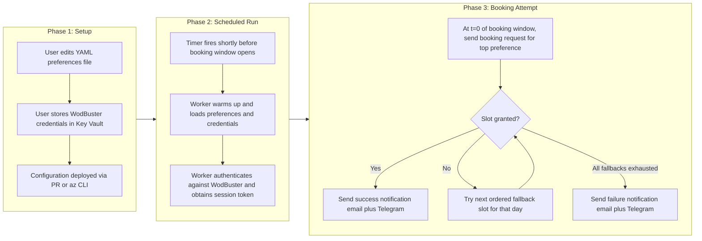

# Envisioning: WodBuster Booking Scheduler

> **Status:** In Discovery
> **Last updated:** 2026-06-29
> **Version:** 1.0

---

## 1. Client Context

### 1.1 Direct Client

| Aspect | Information |
|--------|-------------|
| **Company/Team** | Personal project. The owner is also the primary user. |
| **Domain** | Personal automation for fitness class booking (CrossFit / box classes via the WodBuster platform). |
| **Team scale** | Solo developer. Designed so that 1 or 2 additional friends can be onboarded trivially later. |
| **Channels** | Background scheduler on Azure. Notifications via email and Telegram. Configuration via a Git tracked file. |

### 1.2 End Client

| Aspect | Information |
|--------|-------------|
| **Profile** | Individual athlete who attends a CrossFit box managed through WodBuster. Tech literate enough to edit a YAML file or accept a PR. |
| **Volume** | Between 1 and 10 users for the foreseeable future. Initial rollout targets a single user. |
| **Usage context** | The athlete configures preferred class types and time slots once. The bot then runs unattended and books the slot the instant the booking window opens. The athlete only interacts with the system to read notifications or update preferences. |

### 1.3 Additional Context

No existing system is being consolidated or replaced. Today the user books manually through the WodBuster web interface and frequently loses the spot because popular classes fill in under 10 seconds after the booking window opens.

---

## 2. Project Focus

### Prioritized Problem

Popular classes at the user's box open at a fixed time and fill in under 10 seconds. Manual login and click loses the spot. The user also forgets booking windows and ends up on the waitlist.

| Aspect | Decision |
|--------|----------|
| **Chosen focus** | Reliably book a preferred class within the first second of the booking window opening, with no manual intervention. |
| **Justification** | Latency is the dominant constraint. Any solution that requires human action at booking time will keep losing spots. The remaining requirements (preferences, notifications, multi user) are secondary to closing the latency gap. |
| **Initial scope** | Single user. API only client against WodBuster. Recurring weekly preference model with ordered fallback slots per day. Email and Telegram notifications on success and on failure. Credentials in Azure Key Vault. |
| **Out of initial scope** | Cancellations (handled manually by the user in WodBuster). HTML scraping or DOM automation as a fallback. Real time UI for editing preferences. Multi box or multi tenant management. Booking strategies that exceed one request per attempt. |

---

## 3. Target Users

### 3.1 Primary User: The Project Owner

The athlete who owns the project and runs the bot for himself.

**Key needs:**

- Configure preferred class type and time slot once and forget about it.
- Be in the very first booking attempt the moment the window opens.
- Receive a clear confirmation or failure notification on every attempt.
- Trust that a missed run will not fail silently.

### 3.2 Secondary User: Invited Friend (1 to 2 people)

A friend at the same or compatible WodBuster box who is added later by the owner.

**Key needs:**

- Have personal preferences and credentials kept isolated from the owner's.
- Be onboarded without requiring code changes beyond editing a config file and adding credentials to Key Vault.

---

## 4. Diagnosis: Known Pain Points

### 4.1 Business Pain Points

| Problem | Impact | Source |
|---------|--------|--------|
| Popular classes fill in under 10 seconds and the user loses the spot when booking manually. | Missed training sessions, frustration, reduced value from the gym membership. | Direct observation by the project owner. |
| The user forgets when the booking window opens and ends up on the waitlist. | Same as above. Compounded by the fact that the waitlist rarely promotes in time. | Direct observation by the project owner. |
| No reliable way to express a fallback preference (try 19:00 first, otherwise 20:00, otherwise 18:00). | Either the user picks one slot and accepts losing it, or attempts several bookings manually and may miss all of them. | Direct observation by the project owner. |

**Main impact area:**

- [x] End user experience
- [ ] Internal operations
- [ ] Costs/efficiency
- [ ] Growth/scalability
- [ ] Multiple areas

### 4.2 Technical Pain Points

| Category | Problem | Impact |
|----------|---------|--------|
| Performance | Booking must complete within a 10 second budget from window open to confirmed reservation. Any cold start or extra round trip can cause a miss. | Defines the entire hosting and warmup strategy. Cheap serverless tiers may not meet the budget. |
| Integration | WodBuster API availability and stability are unknown. The auth flow appears to require username and password against a web form, then a session cookie or token reused for booking calls. | Project feasibility depends on the outcome of an API discovery spike. If no usable API exists, the project stops because scraping is excluded by hard constraint. |
| Security | WodBuster credentials must be stored safely and rotated when needed. Session tokens may need to be refreshed periodically by the bot. | Requires a managed identity plus Azure Key Vault integration from day one, even for a single user. |
| Observability | A single point of failure exists. If the Azure region, the timer, or the scheduler has an incident, booking misses are silent unless the system actively reports that it did not run. | Requires a heartbeat or dead man's switch pattern so that "no notification" is itself treated as an anomaly. |

---

## 5. User Journey

The journey is deliberately linear. Each scheduled run is independent. The setup phase happens once per user, with rare edits afterwards.

---

## 6. Strategic Goals and Success Criteria

### 6.1 Goal

Make booking deterministic for the user. Configure preferred class type and time slot once, save the preference, then forget about it. The bot books the spot in the very first second the booking window opens so that the user never lands on the waitlist.

### 6.2 Success KPIs

| KPI | Target |
|-----|--------|
| End to end latency from window open to confirmed booking | Under 10 seconds in the steady state. |
| Booking success rate for the top preferred slot when the gym has capacity | Greater than 95 percent over a rolling 4 week window. |
| Silent failures (run did not execute and no notification was emitted) | Zero. Every scheduled run must produce either a success notification, a failure notification, or a heartbeat alarm. |
| Onboarding effort for an additional user | A single PR adding the user's YAML file plus one secret added to Key Vault. No code changes. |

---

## 7. Hard Constraints

These constraints are foundational. They cannot be revisited in the planning phase without explicit user approval.

1. **API only client.** The solution must consume WodBuster's API endpoints directly. HTML scraping, DOM clicking, and style or CSS parsing are excluded.
2. **Latency budget under 10 seconds.** From the booking window opening instant to a confirmed booking response.
3. **Polite client behavior.** The client rate limits itself, performs a single request per booking attempt, and does not issue parallel requests. The WodBuster Terms of Service risk is acknowledged.

---

## 8. Locked Technical Choices

| Area | Choice | Notes |
|------|--------|-------|
| Language | Python | Locked. |
| Cloud | Azure | Locked. |
| Hosting shape | Azure serverless with timer trigger (Functions or Container Apps Jobs) | Exact service to be chosen in the planning phase based on cold start versus latency trade off. |
| Secrets | Azure Key Vault | Locked. Includes WodBuster credentials and any derived session tokens that need to persist. |
| Cost tolerance | Unlimited | Optimize for reliability and latency. Cost is not a tiebreaker. |

---

## 9. Open Questions and Items to Decide Later

These items are deliberately not resolved here. They belong in the planning phase or in a Phase 0 discovery spike.

| Item | Why it is open | Where it should be resolved |
|------|----------------|-----------------------------|
| Does WodBuster expose a usable API? Is it documented? Is it stable? | Unknown today. The whole project depends on the answer. | Phase 0 discovery spike before any production work. |
| Exact authentication flow against WodBuster. | Likely username and password to a web form, then a session cookie or JWT reused for booking calls. Needs confirmation. | Phase 0 discovery spike. |
| Hosting service selection between Azure Functions Premium with always ready instances, Container Apps Jobs with min replicas 1, or a Consumption plan with a pre warm timer. | Cold start behavior under the 10 second budget must be measured. | Planning phase, captured as an ADR. |
| Exact booking window offset for the user's box (for example 48 hours before class start). | Supplied by the user later. | Configuration time. Recorded in the user's preferences file. |
| Configuration interface for preferences. | Recommendation in section 11 is a Git tracked YAML file per user. Final decision is deferred. | Planning phase, captured as an ADR. |

---

## 10. Risks

| Risk | Likelihood | Impact | Mitigation |
|------|------------|--------|------------|
| WodBuster API does not exist or is undocumented and unstable. | Medium to high. | Project may be unfeasible because scraping is excluded. | Run a Phase 0 discovery spike. Treat its outcome as a go or no go gate. |
| Automating bookings may breach the WodBuster Terms of Service. | Known. | Account suspension. | Polite client by design: rate limited, single request per attempt, no parallel hammering. Behavior reviewed during planning. |
| Cold start latency on cheaper Azure tiers exceeds the 10 second budget. | Medium. | Booking misses despite the system being healthy. | Evaluate Premium Functions with always ready, Container Apps Jobs with min replicas 1, or pre warm timers. Measure before committing. |
| Credential handling complexity (storing WodBuster username and password, plus possible session token refresh). | Medium. | Security exposure if mishandled. Operational toil if refresh is fragile. | Azure Key Vault from day one with managed identity. Token refresh logic isolated and observable. |
| Single point of failure. If the Azure region, the timer, or the scheduler has an incident, a missed booking can go silent. | Low to medium. | User loses trust in the system. | Heartbeat or dead man's switch pattern. "No notification" is itself treated as an anomaly and surfaces an alert. |

---

## 11. Recommendations (To Be Validated in Planning)

The following recommendation is surfaced here to give the planning phase a clear starting point. It is not a final decision.

**Configuration and notification interface for 1 to 3 users:**

- One Git tracked YAML file per user describing the recurring weekly schedule and the ordered fallback slots per day.
- WodBuster credentials per user stored in Azure Key Vault.
- Updates applied via Pull Request or the az CLI. Git history acts as an audit log.
- Telegram bot is notification only. It does not accept commands.

Rationale: simplest path for a small group of technical or semi technical users. Avoids building a UI. Provides an audit trail naturally. Aligns with the chosen notification channels. The final decision and any alternatives (for example a minimal admin UI, or a Telegram command interface) belong in the planning phase and should be captured as an ADR.
