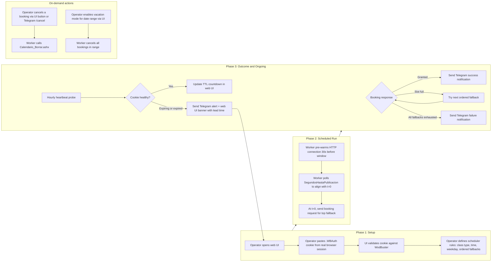

# Envisioning: WodBuster Booking Scheduler

> **Status:** Phase 0 complete (GO drafted). Production feature scope expanded.
> **Last updated:** 2026-06-29
> **Version:** 1.1

---

## 1. Client Context

### 1.1 Direct Client

| Aspect | Information |
|--------|-------------|
| **Company/Team** | Personal project. The owner is also the primary user. |
| **Domain** | Personal automation for fitness class booking (CrossFit / box classes via the WodBuster platform). |
| **Team scale** | Solo developer. Designed so that 1 or 2 additional friends can be onboarded trivially later. |
| **Channels** | Background scheduler on Azure. Web UI for full management (scheduler rule CRUD, cookie paste-and-validate, booking history, worker health). Telegram bot for read and act on the go (list bookings, cancel, acknowledge alerts) and for all notifications (success, failure, cookie-expiry warning, heartbeat anomaly). |

### 1.2 End Client

| Aspect | Information |
|--------|-------------|
| **Profile** | Individual athlete who attends a CrossFit box managed through WodBuster. Comfortable with a small web UI and a Telegram bot. No CLI or YAML editing required. |
| **Volume** | Between 1 and 10 users for the foreseeable future. Initial rollout targets a single user. |
| **Usage context** | The athlete configures scheduler rules (preferred class types + time slots, ordered fallbacks) through the web UI once. The bot then runs unattended and books each slot the instant its booking window opens. The athlete uses the web UI for rule changes and the Telegram bot for quick actions (cancel a class, check next booking) and to receive notifications. Manual intervention required only when the WodBuster session cookie eventually expires, at which point the operator is alerted hours in advance with a one-click paste-and-validate flow. |

### 1.3 Additional Context

No existing system is being consolidated or replaced. Today the user books manually through the WodBuster web interface and frequently loses the spot because popular classes fill in under 10 seconds after the booking window opens.

---

## 2. Project Focus

### Prioritized Problem

Popular classes at the user's box open at a fixed time and fill in under 10 seconds. Manual login and click loses the spot. The user also forgets booking windows and ends up on the waitlist.

| Aspect | Decision |
|--------|----------|
| **Chosen focus** | Reliably book a preferred class within the first second of the booking window opening, with no manual intervention. |
| **Justification** | Latency is the dominant constraint. Any solution that requires human action at booking time will keep losing spots. The remaining requirements (preferences, notifications, multi user) are secondary to closing the latency gap. |
| **Initial scope** | Single user. Stock HTTP client against WodBuster (no SignalR, no browser at booking time, confirmed by Phase 0). Recurring weekly scheduler rule model with ordered fallback slots per day. Full rule CRUD via web UI. Cancellation in two flavors: single manual cancel via UI or Telegram, plus bulk cancel for a date range (vacation mode). Telegram bot for read, act, and notify. Notifications on success, failure, cookie-expiry warning, and heartbeat anomaly. Auth via single `.WBAuth` cookie pasted once by the operator into the web UI, with sliding-session auto-renewal and a proactive heartbeat probe that alerts hours in advance when the cookie nears expiry. |
| **Out of initial scope** | HTML scraping or DOM automation. Automated browser login (Playwright). Storage of WodBuster credentials (only the session cookie is persisted). Rule-based auto-cancel triggered by complex conditions. Multi-box or multi-tenant management. Booking strategies that exceed one request per attempt. Onboarding of additional users beyond the operator. |

---

## 3. Target Users

### 3.1 Primary User: The Project Owner

The athlete who owns the project and runs the bot for himself.

**Key needs:**

- Configure preferred class type and time slot once and forget about it.
- Be in the very first booking attempt the moment the window opens.
- Receive a clear confirmation or failure notification on every attempt.
- Trust that a missed run will not fail silently.

### 3.2 Secondary User: Invited Friend (1 to 2 people, post-MVP)

A friend at the same or compatible WodBuster box who could be added in a later phase. Out of scope for the initial MVP.

**Key needs:**

- Have personal scheduler rules and cookie kept isolated from the owner's.
- Be onboarded without code changes (web UI self-service).

---

## 4. Diagnosis: Known Pain Points

### 4.1 Business Pain Points

| Problem | Impact | Source |
|---------|--------|--------|
| Popular classes fill in under 10 seconds and the user loses the spot when booking manually. | Missed training sessions, frustration, reduced value from the gym membership. | Direct observation by the project owner. |
| The user forgets when the booking window opens and ends up on the waitlist. | Same as above. Compounded by the fact that the waitlist rarely promotes in time. | Direct observation by the project owner. |
| No reliable way to express a fallback preference (try 19:00 first, otherwise 20:00, otherwise 18:00). | Either the user picks one slot and accepts losing it, or attempts several bookings manually and may miss all of them. | Direct observation by the project owner. |

**Main impact area:**

- [x] End user experience
- [ ] Internal operations
- [ ] Costs/efficiency
- [ ] Growth/scalability
- [ ] Multiple areas

### 4.2 Technical Pain Points

| Category | Problem | Impact |
|----------|---------|--------|
| Performance | Booking must complete within a 10 second budget from window open to confirmed reservation. Phase 0 measured 336 ms warm scripted booking call against WodBuster; cold connection adds ~1.3 s for DNS + TLS. Pre-warming the connection ahead of the window collapses cold cost. | Budget is met with >96% headroom on warm calls. Pre-warm pattern is the design default. |
| Integration | Confirmed by Phase 0 spike (2026-06-29). WodBuster exposes the booking action as a plain `GET` to `Calendario_Inscribir.ashx` with three query parameters (`id`, `ticks`, `idu`) and a single `.WBAuth` auth cookie. No SignalR, no browser, no anti-bot signal observed on the authenticated subdomain. See `docs/features/phase-0-api-discovery/feasibility-report.md`. | Architecturally lowest-cost runtime: stock Python `requests` client. Booking call ~336 ms warm. |
| Security | No WodBuster credentials are stored. Only the `.WBAuth` session cookie is persisted (encrypted at rest in the chosen store). The cookie has sliding expiration; the worker's routine polls keep it alive. A heartbeat probe runs every hour to detect natural expiry and alerts the operator hours in advance via Telegram, with a one-click paste-and-validate flow in the web UI. | Lower blast radius than credential storage. Operator intervention is rare (weeks between paste events) and never time-pressured. |
| Observability | A single point of failure exists. If the Azure region, the timer, or the scheduler has an incident, booking misses are silent unless the system actively reports that it did not run. | Requires a heartbeat or dead man's switch pattern so that "no notification" is itself treated as an anomaly. Heartbeat is also the cookie-validity probe. |

---

## 5. User Journey

Each scheduled run is independent. The setup phase happens once per operator and is revisited only when the cookie naturally expires (estimated cadence: weeks). Cancellation and vacation mode are operator-initiated and do not require scheduled triggers.

---

## 6. Strategic Goals and Success Criteria

### 6.1 Goal

Make booking deterministic for the user. Configure preferred class type and time slot once, save the preference, then forget about it. The bot books the spot in the very first second the booking window opens so that the user never lands on the waitlist.

### 6.2 Success KPIs

| KPI | Target |
|-----|--------|
| End to end latency from window open to confirmed booking | Under 10 seconds in the steady state. |
| Booking success rate for the top preferred slot when the gym has capacity | Greater than 95 percent over a rolling 4 week window. |
| Silent failures (run did not execute and no notification was emitted) | Zero. Every scheduled run must produce either a success notification, a failure notification, or a heartbeat alarm. |
| Onboarding effort for an additional user (post-MVP) | Operator creates a new isolated user record through the web UI and the new operator pastes their own cookie. No code changes. | Post-MVP; not a release criterion for the initial scope. |
| Cookie-expiry surprise (operator forced to react under time pressure) | Zero. The heartbeat probe must detect expiry and alert the operator at least N hours before the next scheduled booking window (N to be set in the spec, recommended >= 12 hours). |

---

## 7. Hard Constraints

These constraints are foundational. They cannot be revisited in the planning phase without explicit user approval.

1. **API only client.** The solution must consume WodBuster's API endpoints directly. HTML scraping, DOM clicking, and style or CSS parsing are excluded.
2. **Latency budget under 10 seconds.** From the booking window opening instant to a confirmed booking response.
3. **Polite client behavior.** The client rate limits itself, performs a single request per booking attempt, and does not issue parallel requests. The WodBuster Terms of Service risk is acknowledged.
4. **No silent degradation.** Every scheduled run produces a positive notification (success, failure, or heartbeat anomaly). "No notification" is itself an alarm condition.
5. **No time-pressured manual intervention.** Cookie expiry must never first surface as a booking-time failure. The operator must be alerted with at least 12 hours of lead time before the next scheduled booking window (target lead time to be confirmed in the spec phase).
6. **No automated WodBuster credential handling.** WodBuster username and password are never stored, sent, or processed by the system. The operator authenticates manually in a real browser and pastes only the resulting session cookie.

---

## 8. Locked Technical Choices

| Area | Choice | Notes |
|------|--------|-------|
| Language | Python | Locked. Phase 0 reproduction script already in Python. |
| Cloud | Azure | Locked. |
| Hosting shape | Long-running service with internal scheduler (Container Apps, App Service Linux, or container on a small VM) | The web UI + Telegram bot webhook + scheduler runtime + heartbeat probe + state persistence collectively rule out pure timer-trigger Functions Consumption. Exact service selection deferred to planning ADR. |
| Auth and session | `.WBAuth` cookie paste-and-store. No WodBuster credentials at rest. | Operator pastes the cookie once via the web UI. Sliding expiration plus routine polls keep it alive. Heartbeat probe detects natural expiry and alerts hours in advance. |
| Persistence | Small relational store (Postgres, SQLite, or equivalent) | For scheduler rules, booking history, and the encrypted cookie blob. Exact engine deferred to planning ADR. |
| Scheduler management surface | Web UI (full CRUD + cookie paste + observability) AND Telegram bot (read, act, notify) | Both surfaces are in scope for the MVP. |
| Secrets | Azure Key Vault for the cookie encryption key, the Telegram bot token, and any internal API tokens | Locked. Note: WodBuster credentials are NOT stored. |
| Cost tolerance | Optimize for reliability and latency first. Cost is not a tiebreaker but should be reasonable for a personal project (~ tens of euros per month is acceptable; ~ hundreds is not). |

---

## 9. Open Questions and Items to Decide Later

Most initial open questions were resolved by the Phase 0 spike. The remaining items belong in the planning phase.

| Item | Why it is open | Where it should be resolved |
|------|----------------|-----------------------------|
| Hosting service selection (Container Apps vs App Service Linux vs small VM) | Need a runtime that supports a long-lived web app + Telegram webhook + internal scheduler + persistence. Cost and operational complexity differ. | Planning phase, captured as the `hosting-service` ADR. |
| Persistence engine (Postgres Flexible Server vs SQLite-on-disk vs Cosmos DB Free Tier) | The schema is small and single-tenant; the simplest reliable store wins. | Planning phase, captured as the `persistence` ADR. |
| Exact booking window offset for the user's box (for example 48 hours before class start) | Supplied by the user later. | Configuration time, entered through the web UI. |
| Cookie-expiry alert lead time (recommendation: at least 12 hours) | Operator workflow constraint; needs a single numeric default. | Spec phase. |
| WodBuster `.WBAuth` cookie absolute lifetime (does sliding session never expire, or is there a hard ceiling?) | Unknown until a 2-3 day passive observation test runs. Does not block the design (heartbeat + alert + paste covers the worst case) but informs the operator's expected paste frequency. | Spike during early implementation. |

### Resolved by Phase 0 spike

| Original question | Resolution | Reference |
|-------------------|------------|-----------|
| Does WodBuster expose a usable API? | Yes. `GET /athlete/handlers/Calendario_Inscribir.ashx` with 3 query params and 1 cookie. | feasibility-report.md, Booking request section |
| Authentication flow | Single `.WBAuth` Forms Authentication cookie on `.wodbuster.com`. Pasted once from a real browser session. No credentials needed. | feasibility-report.md, Authentication flow section |
| Configuration interface for preferences | Web UI for full CRUD (single source of truth), Telegram bot for read and act on the go. | Decided in envisioning v1.1 (this section, replacing the YAML-in-Git recommendation). |

---

## 10. Risks

| Risk | Likelihood | Impact | Mitigation |
|------|------------|--------|------------|
| Automating bookings may breach the WodBuster Terms of Service. | Known. Phase 0 ToS analysis verdict: soft restriction, leaning permissive for personal use. | Account suspension. | Polite client by design: rate limited, single request per attempt, no parallel hammering. Reuses a real browser-established session, never bypasses Cloudflare programmatically. Single-user scope. |
| `.WBAuth` cookie has a hard absolute lifetime (not pure sliding) and expires unexpectedly. | Unknown until observed. | Operator must paste a new cookie within the alert lead time. | Heartbeat probe alerts hours in advance via Telegram, web UI shows expiry countdown, one-click paste-and-validate. |
| Cold start latency on cheaper Azure tiers exceeds the 10 second budget. | Low (Phase 0 measured 336 ms warm; 1.3 s cold including DNS+TLS). | Booking misses despite the system being healthy. | Pre-warm connection 30 seconds before booking window. Connection-warming poll already part of the design (the `SegundosHastaPublicacion` countdown poll). |
| Single point of failure. If the Azure region, the timer, or the scheduler has an incident, a missed booking can go silent. | Low to medium. | User loses trust in the system. | Heartbeat or dead man's switch pattern. "No notification" is itself treated as an anomaly and surfaces an alert. Heartbeat doubles as the cookie-validity probe. |
| Web UI exposed to the public internet without proper auth. | Low if designed carefully. | Anyone could read the cookie or trigger bookings. | Web UI gated by operator-only credentials (or restricted to a private network / VPN). Cookie blob encrypted at rest. Decided in the planning phase. |
| Telegram bot token leaked. | Low. | Attacker could spoof notifications or impersonate the bot. | Token in Key Vault. Bot validates that incoming commands come from the operator's known chat ID. |

---

## 11. Recommendations (To Be Validated in Planning)

The following recommendation is surfaced here to give the planning phase a clear starting point. It reflects decisions taken in envisioning v1.1 after the Phase 0 spike and the scope expansion conversation.

**Production worker architecture:**

- Long-running service hosting (a) a web UI for full CRUD on scheduler rules + cookie paste + observability, (b) a Telegram bot webhook for read/act/notify, (c) the internal scheduler runtime that fires booking calls, and (d) the heartbeat probe.
- Single `.WBAuth` cookie pasted by the operator once via the web UI, persisted encrypted at rest. No WodBuster username or password is ever stored.
- Sliding-session keep-alive via routine `SegundosHastaPublicacion` polls. Hourly dedicated heartbeat probe that detects natural cookie expiry early. Proactive Telegram alert and web UI banner with at least 12 hours of lead time before the next scheduled booking window.
- Booking call: stock HTTP client, three query parameters (`id`, `ticks`, `idu`), pre-warmed connection. No SignalR, no browser.
- Cancellation: single-cancel via UI button or Telegram `/cancel` command; bulk-cancel by date range (vacation mode) via UI.

**Rationale:** Phase 0 evidence eliminates SignalR, browser automation, and credential storage from the runtime. The most expensive thing the worker does is poll a JSON endpoint and fire a single GET. The remaining design weight is in the management surfaces (web UI + Telegram) and the alerting pipeline. Hosting choice, persistence engine, and observability stack are all deferred to ADRs in the planning phase.

---

## 12. Revision History

| Version | Date | Change |
|---------|------|--------|
| 1.0 | 2026-06-29 | Initial envisioning. Project entered Phase 0 discovery. |
| 1.1 | 2026-06-29 | Updated after Phase 0 spike completion and scope-expansion conversation. Phase 0 outcomes folded into sections 4.2, 8, 9, 10, 11. Scope expanded to include cancellation (manual single + bulk by date range), full scheduler rule CRUD via web UI, Telegram bot as read/act/notify channel, and cookie-handoff auth with heartbeat probe + proactive alert + one-click paste refresh. Removed YAML-in-Git configuration model. Removed Azure Key Vault for WodBuster credentials (no credentials are stored). Hosting shape narrowed from Functions/Jobs to long-running service. |
