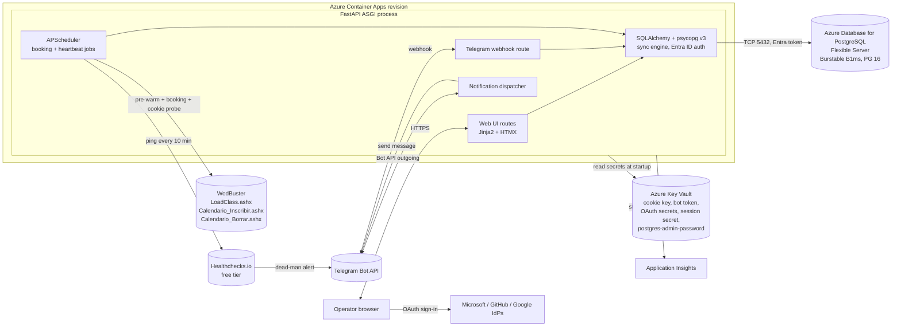

# Implementation Plan: WodBuster Booking Worker

- **Created on**: 2026-06-29
- **Status**: Draft
- **Spec**: `docs/features/wodbuster-booking-worker/spec.md`
- **Envisioning**: `docs/envisioning/wodbuster-booking-scheduler.md`
- **Phase 0 report**: `docs/features/phase-0-api-discovery/feasibility-report.md`
- **Type**: Production feature, new surface.

## Summary

This plan implements the production booking worker described in the feature spec. The worker is a single Python ASGI process (FastAPI plus Jinja2 plus HTMX plus APScheduler) running in one Azure Container Apps replica. Persistent state lives in an Azure Database for PostgreSQL Flexible Server (Burstable B1ms, Postgres 16, Spain Central AZ1), accessed via the runtime user-assigned managed identity over Microsoft Entra ID authentication. Operator authentication uses federated identity across Microsoft personal, GitHub, and Google. Secrets live in Azure Key Vault, accessed by the same user-assigned managed identity. Notifications are delivered via Telegram and a web banner; external dead-man monitoring is provided by Healthchecks.io with Application Insights as the metrics and log sink. Infrastructure is Bicep orchestrated by `azd`, a single `prod` environment in one resource group. Local development runs against a real Postgres 16 container via `docker compose` (no SQLite anywhere in the stack; see ADR-0002 change history for the pivot rationale).

**Monthly cost ballpark**: roughly 13-15 EUR per month, driven by the Postgres Flexible Server (approximately 12-13 EUR for B1ms + 32 GiB + 7-day backup) plus Key Vault, Container Apps, and Application Insights (under 2 EUR combined at single-user cadence). This is up from the original 5 EUR ballpark; ADR-0002 documents the trade-off.

The seven architectural decisions captured under `docs/architecture/decisions/` are the source of truth for cross-cutting choices. This plan references them rather than restating their content.

## Referenced ADRs

| ADR | Topic | Status |
|-----|-------|--------|
| `0001-hosting-service.md` | Azure Container Apps, `min-replicas=1`, no scale-to-zero, single container, single ASGI process. | Proposed |
| `0002-persistence.md` | Azure Database for PostgreSQL Flexible Server (Burstable B1ms, PG 16, Spain Central AZ1, 32 GiB autogrow, 7-day backup, no HA, public network + firewall + Entra ID auth). Application-layer AES-256-GCM encryption for the cookie blob. Amended 2026-07-02 (pivot from SQLite on Azure Files). | Proposed |
| `0003-auth-and-session.md` | WodBuster session via paste-and-validate, single `.WBAuth` cookie, hourly heartbeat doubling as sliding-session refresh, 24h-lead-time alert. | Proposed |
| `0004-configuration-interface.md` | FastAPI plus Jinja2 plus HTMX, server-rendered with partial updates, same process hosts Telegram webhook and APScheduler. | Proposed |
| `0005-secrets-and-identity-access.md` | Azure Key Vault plus user-assigned managed identity. Federated operator login across Microsoft, GitHub, Google. Allow-list in the database. | Proposed |
| `0006-observability-and-heartbeat.md` | Internal APScheduler anomaly detection, external Healthchecks.io free tier, App Insights logs and metrics, single Azure Monitor backstop alert. | Proposed |
| `0007-iac-tooling.md` | Bicep modules orchestrated by `azd`, single `prod` environment, single resource group. | Proposed |

## Engineering Practices

| Practice | Decision | Reference |
|----------|----------|-----------|
| Branch strategy | Trunk-based on `main`. Short-lived feature branches via PR. No `develop` branch. | Defined by the team. |
| CI | GitHub Actions running `ruff`, `mypy`, `pytest`, and container image build plus push to ACR on PR merge to `main`. | Defined by the team. |
| CD | GitHub Actions is the provisioning source of record. `.github/workflows/infra.yml` runs `azd provision` on `main` when `infra/**` or `azure.yaml` change; `.github/workflows/deploy.yml` runs `azd deploy` on `main` when `src/**` or the `Dockerfile` change; `.github/workflows/infra-preview.yml` posts a `azd provision --preview` what-if diff on PRs touching infra. All workflows authenticate to Azure via OIDC against a dedicated deploy UAMI (ADR-0005). No approval gate for MVP. Single environment (`prod`). No staging. Laptop `azd provision` is bootstrap-only after F3.10. | ADR-0005, ADR-0007. |
| Test framework | `pytest` plus `pytest-asyncio`. Mocked WodBuster client for unit tests. One live-contract test gated by env var that hits real WodBuster with the operator's cookie. | Defined by the team. |
| Observability | Structured logs via `structlog` to Application Insights. Request and response timing on every WodBuster call. Single Azure Monitor alert rule "no Telegram notification produced in last 24h" as a backstop to the internal heartbeat. | ADR-0006. |
| Secret management | All secrets in Azure Key Vault, read at startup via user-assigned managed identity. No secrets in repo, environment files, or container image. | ADR-0005. |
| IaC | Bicep modules under `infra/`, orchestrated by `azd`. | ADR-0007. |

## System Overview

Single ASGI process inside one Container App revision. All concerns colocate.



## Data Model

Persisted in Azure Database for PostgreSQL (Flexible Server, Burstable B1ms, PG 16) via SQLAlchemy with the `psycopg` v3 sync driver. Migrations via Alembic, applied on container startup under the runtime UAMI's Entra ID identity (see ADR-0002 three-principal model). Postgres-native types are used where the shape calls for them: `JSONB` for free-form payload columns (`notification_outbox.payload`, `alert.payload`, `booking_outcome.response_payload`), native `ENUM` types for enumerated status columns, `TIMESTAMPTZ` for all timestamps, and partial unique indexes via `postgresql_where=` (notably on `alert.(operator_id, kind)` restricted to open rows).

| Table | Purpose | Key columns |
|-------|---------|-------------|
| `operator_profile` | Single human user. | `id`, `display_name`, `telegram_chat_id`, `created_at` |
| `federated_identity` | One row per allow-listed `(provider, subject_id)` for an operator. | `id`, `operator_id`, `provider`, `subject_id`, `display_name`, `created_at` |
| `scheduler_rule` | Recurring weekly booking intent. | `id`, `operator_id`, `day_of_week`, `window_offset_hours`, `active`, `created_at`, `updated_at` |
| `class_preference` | Ordered preferences inside a rule. | `id`, `rule_id`, `order_index`, `class_type`, `target_time_slot` |
| `cookie_credential` | Encrypted `.WBAuth` blob for the operator. | `id`, `operator_id`, `ciphertext`, `nonce`, `pasted_at`, `last_validated_at`, `projected_ttl_at`, `last_probe_status` |
| `booking_outcome` | One row per execution attempt. | `id`, `operator_id`, `rule_id` (nullable), `target_class`, `target_slot`, `attempted_at`, `terminal_status`, `granted_fallback_index` (nullable), `response_payload`, `notified_at` (nullable) |
| `vacation_window` | Date ranges with skip-and-cancel semantics. | `id`, `operator_id`, `start_date`, `end_date`, `created_at`, `closed_at` (nullable) |
| `heartbeat_reading` | One row per cookie probe. | `id`, `operator_id`, `probed_at`, `result`, `projected_ttl_at`, `alert_id` (nullable) |
| `alert` | Pending or acknowledged operator-facing conditions. | `id`, `operator_id`, `kind`, `payload`, `first_emitted_at`, `last_emitted_at`, `acknowledged_at` (nullable), `cleared_at` (nullable) |
| `notification_outbox` | Pending deliveries to Telegram or the web banner pool. | `id`, `kind`, `target`, `payload`, `enqueued_at`, `dispatched_at` (nullable), `attempt_count` |

Cross-cutting rules:

- Every write that mutates state and produces an operator-visible signal writes the entity row and the corresponding `notification_outbox` row in the same SQLAlchemy session-level transaction (spec Failure Modes consistency model).
- `cookie_credential.ciphertext` is AES-256-GCM under the Key Vault-held key. Plaintext never persists. The nonce is stored alongside the ciphertext.
- The `alert` table holds at most one open row per `(operator_id, kind)` to prevent duplicate banners across concurrent cycles.

## Contracts and Interfaces

### Web UI routes

| Method | Route | Auth | Purpose |
|--------|-------|------|---------|
| GET | `/` | session | Dashboard: next windows, banners, latest outcomes. |
| GET | `/auth/{provider}/login` | none | OAuth start (provider in `microsoft`, `github`, `google`). |
| GET | `/auth/{provider}/callback` | none | OAuth callback, allow-list check, session creation. |
| POST | `/auth/logout` | session | Clear session. |
| GET | `/rules` | session | List rules. |
| POST | `/rules` | session | Create rule. |
| GET | `/rules/{id}` | session | Read rule. |
| POST | `/rules/{id}` | session | Update rule (HTMX form submit). |
| POST | `/rules/{id}/delete` | session | Delete rule. |
| GET | `/cookie` | session | Cookie status, TTL, paste form. |
| POST | `/cookie` | session | Paste-and-validate. |
| GET | `/history` | session | Booking history, newest first. |
| GET | `/vacation` | session | List vacation windows, form. |
| POST | `/vacation` | session | Enable vacation window. |
| POST | `/vacation/{id}/close` | session | Close vacation window early. |
| GET | `/book-now` | session | Manual ad-hoc booking form. |
| POST | `/book-now` | session | Submit manual ad-hoc booking. |
| POST | `/bookings/{id}/cancel` | session | Cancel one booking. |
| POST | `/alerts/{id}/acknowledge` | session | Acknowledge a banner. |
| POST | `/telegram/webhook` | shared secret in URL path | Telegram bot updates. |
| GET | `/health` | none | Dead-man target for Healthchecks.io. Returns 200 if APScheduler is alive and the DB file is writable. |

### Telegram bot commands

| Command | Action |
|---------|--------|
| `/start` | Bind chat ID via one-time token from the web UI. |
| `/next` | List the next scheduled windows. |
| `/last` | List the latest booking outcomes. |
| `/bookclass <YYYY-MM-DD> <HH:MM>` | Manual ad-hoc booking (FR-018). Rejected if outside booking window (FR-019). |
| `/cancel <booking-id>` | Cancel a granted booking (FR-014). |
| `/ack` | Acknowledge the current open cookie-expiring alert for the current heartbeat cycle (FR-027). |
| `/help` | Command help. |

Any rule create, update, or delete command is rejected with an explanatory message and no state mutation (FR-003).

### WodBuster client (server-to-server)

| Endpoint | Method | Purpose | Source |
|----------|--------|---------|--------|
| `LoadClass.ashx` | GET | Cookie validation, sliding-session probe, class visibility check, post-booking confirmation read. | Phase 0 feasibility report. |
| `Calendario_Inscribir.ashx` | GET | Book a slot. Query params `id`, `ticks`, `idu`. | Phase 0. |
| `Calendario_Borrar.ashx` | GET | Cancel a booking. | Envisioning user journey. |

All calls carry the single `.WBAuth` cookie. No other authentication header. One request per booking attempt. No parallel requests.

## Booking Sequence

```mermaid
sequenceDiagram
    autonumber
    participant Sched as APScheduler
    participant Worker as Worker logic
    participant DB as SQLite (Azure Files)
    participant WB as WodBuster
    participant Outbox as Notification dispatcher
    participant TG as Telegram

    Note over Sched: 30s before booking window
    Sched->>Worker: pre_warm_connection(window)
    Worker->>WB: GET LoadClass.ashx (warm TCP/TLS)
    WB-->>Worker: 200 OK + countdown

    Note over Sched: at window open
    Sched->>Worker: poll SegundosHastaPublicacion
    Worker->>WB: GET LoadClass.ashx
    WB-->>Worker: 200 OK + SegundosHastaPublicacion
    Worker->>Worker: align to t=0

    loop walk ordered fallbacks
        Worker->>WB: GET Calendario_Inscribir.ashx?id&ticks&idu
        WB-->>Worker: 200 OK + Res
        alt Res = Granted
            Worker->>DB: INSERT booking_outcome + notification_outbox (one tx)
            DB-->>Worker: commit
            Outbox->>TG: success message
            Outbox->>DB: mark notified_at
        else Res = Full
            Worker->>Worker: next fallback
        else Res = CookieInvalid
            Worker->>DB: INSERT failure outcome + "paste new cookie" alert + outbox rows (one tx)
            DB-->>Worker: commit
            Outbox->>TG: failure + alert messages
            break fail-fast (FR-011)
        end
    end

    alt class not visible
        loop up to 2 min, every 5s
            Worker->>WB: GET LoadClass.ashx
            WB-->>Worker: 200 OK
        end
        Worker->>DB: INSERT "class not visible" outcome + outbox (one tx)
        Outbox->>TG: failure message
    end
```

## Implementation Phases

Sequential. Each phase ends with a green test suite on `main`.

### Phase 1: Project skeleton

- Repository layout: `src/wodbuster_worker/{app.py, routes/, scheduler/, persistence/, wodbuster_client/, notifications/, security/}`, `tests/{unit/, contract/}`, `infra/`, `azure.yaml`.
- Tooling: `pyproject.toml` with `fastapi`, `jinja2`, `htmx` (static asset), `apscheduler`, `sqlalchemy`, `alembic`, `httpx`, `structlog`, `azure-identity`, `azure-keyvault-secrets`, `authlib`, `python-telegram-bot`, `cryptography` (for AES-GCM).
- Linting and types: `ruff`, `mypy`.
- Tests: `pytest`, `pytest-asyncio`. Add the `pytest.ini` marker `live_contract` (gated by `RUN_LIVE_WODBUSTER=1`).
- Dockerfile: Python 3.12-slim base, non-root user, install with `pip install --no-deps -r requirements.txt`.

### Phase 2: Infrastructure (Bicep + azd)

- Author `infra/main.bicep` with modules for: resource group, log analytics, application insights, container registry, key vault, user-assigned managed identity, storage account plus Azure Files share, container apps environment, container app, Azure Monitor alert rule (24h notification backstop).
- `azd init`, parameterize for environment name `prod`.
- First `azd up` against the operator's Azure subscription. Manual: create the three OAuth client registrations (Microsoft, GitHub, Google), the Telegram bot via BotFather, and the Healthchecks.io project. Paste the resulting secrets into Key Vault by hand once. See "Manual one-time setup" below.

### Phase 3: Persistence and security primitives

- Implement SQLAlchemy models, Alembic baseline migration.
- Implement the Key Vault loader (Azure SDK with `DefaultAzureCredential` using the UAMI in production, `AzureCliCredential` locally).
- Implement the AES-256-GCM cookie cipher.
- Unit tests: round-trip ciphertext, key-rotation rejection (decryption with a different key must fail cleanly).

### Phase 4: WodBuster client and booking core

- Implement the `httpx`-based WodBuster client with the three endpoints. Single shared `httpx.Client` for connection reuse.
- Implement booking-window scheduling: APScheduler `IntervalJob` for the per-second alignment near a window, plus a one-shot `DateJob` for the booking attempt itself.
- Implement the ordered fallback walk, the class-not-visible retry policy (every 5s up to 2 min, FR-010), and the fail-fast on cookie-invalid (FR-011).
- Unit tests against a mocked WodBuster client. One `live_contract` test that books a real class the operator agrees to cancel manually afterward.

### Phase 5: Cookie handoff and heartbeat

- Implement the paste-and-validate flow (FR-020, FR-021).
- Implement the hourly cookie heartbeat (FR-022) that also pings Healthchecks.io and writes a `heartbeat_reading` row.
- Implement the projected-TTL computation and the 24h-lead-time alert (FR-023).
- Implement the `/ack` Telegram command (FR-027).

### Phase 6: Web UI

- Implement Jinja2 layout, base CSS (no framework, simple), HTMX wiring.
- Implement all routes from the Contracts section.
- Implement the OAuth flow with Authlib against Microsoft personal, GitHub, Google.
- Implement the allow-list check at OAuth callback.
- Implement CSRF protection compatible with HTMX.

### Phase 7: Telegram bot

- Implement webhook handler with per-update shared-secret validation.
- Implement the command set from the Contracts section.
- Implement the chat ID binding flow via one-time token.

### Phase 8: Notifications and dispatcher

- Implement the `notification_outbox` dispatcher as an APScheduler job ticking every 5 seconds.
- Implement the per-run anomaly detector (FR-026) ticking every 60 seconds.
- Implement Telegram delivery with retry and exponential backoff.

### Phase 9: Cancellation and vacation mode

- Implement single-booking cancellation (FR-013, FR-014, FR-016).
- Implement vacation-mode bulk cancellation and the rule-skip behavior (FR-015).
- Implement the idempotency check in the cancellation path.

### Phase 10: Observability hardening

- Wire `structlog` to Application Insights via the OpenCensus exporter or Azure Monitor OpenTelemetry distro.
- Add custom metrics: booking-attempt latency, cookie probe duration, notification dispatch lag, outbox queue depth.
- Author the single Azure Monitor alert rule "no Telegram notification produced in last 24h" in Bicep.

## Manual One-Time Setup

These steps happen once, by the operator, outside CI:

1. **OAuth client registrations**. Register three OAuth clients (Microsoft personal accounts, GitHub OAuth app, Google OAuth client). Set the redirect URI to `https://<container-app-fqdn>/auth/{provider}/callback`. Record the three client IDs (non-secret) and the three client secrets.
2. **Telegram bot creation via BotFather**. Open Telegram, contact BotFather, run `/newbot`, follow prompts, record the bot token.
3. **Healthchecks.io project**. Sign up to the free tier, create one check with the worker's expected ping cadence (every 10 minutes, grace period 20 minutes), record the check UUID, connect Telegram as a notification channel.
4. **Paste secrets into Key Vault**. Using `az keyvault secret set` from the operator's workstation, populate `wodbuster-cookie-encryption-key` (256-bit random value, generated with `openssl rand -base64 32`), `telegram-bot-token`, `session-encryption-secret` (256-bit random value), the three `oauth-{provider}-client-secret` entries, and `postgres-admin-password` (break-glass Postgres server admin password, 32+ characters, generated with `openssl rand -base64 32`). See ADR-0002 and ADR-0005 for the three-principal model that motivates the admin password.
5. **Postgres Entra admin plus role grant**. After the first `azd provision` creates the Postgres server, the operator declares themselves the Entra admin on the server (F3.12) and, connecting as that identity, grants the runtime UAMI's Entra principal `USAGE, CREATE` on schema `public`. This is the one-time bootstrap that lets Alembic run from inside the container. Documented in tasks.md and the README.
6. **Allow-list seed**. On the first deploy, the operator runs the one-time bootstrap command (`python -m wodbuster_worker.bootstrap`) which inserts the operator's chosen federated identity into the `federated_identity` table.
7. **Operator cookie paste**. The operator opens the web UI, signs in, and pastes a fresh `.WBAuth` cookie. The system validates and stores it encrypted.

## Test Strategy

| Layer | Framework | Coverage focus |
|-------|-----------|----------------|
| Unit | `pytest`, `pytest-asyncio`, Postgres 16 via `docker compose` or `testcontainers` | Routing, state machines (alert lifecycle, vacation mode, idempotent cancel), WodBuster client behavior against a mocked HTTP transport, cipher round-trip. Every test runs against real Postgres; there is no SQLite substrate anywhere in the codebase after the 2026-07-02 pivot. |
| Component | `pytest`, real Postgres 16 (same substrate as unit), mocked WodBuster | End-to-end booking flow, end-to-end cancellation, end-to-end vacation mode, end-to-end cookie paste, end-to-end heartbeat-anomaly emission. |
| Live contract | `pytest`, real WodBuster, gated by `RUN_LIVE_WODBUSTER=1` | One booking attempt against the operator's account. Runs only when the env var is set. CI never sets it. |
| Conformance | `pytest`, mocked WodBuster | One test per CC-001 through CC-015 from the spec. |

Coverage target: 80 percent line coverage on `src/wodbuster_worker/`.

## Risks and Mitigations

| Risk | Likelihood | Impact | Mitigation |
|------|------------|--------|------------|
| Postgres Burstable B1ms CPU credit exhaustion during a bursty booking cycle. | Low at single-user scale. | Temporary connection latency spike. | Booking hits the database with a handful of transactions per attempt; well under the B1ms sustained baseline. If credits drain (evident in Azure Monitor), the mitigation is a size bump to B2s, not an architectural change. |
| Runtime UAMI Entra token acquisition fails during a booking cycle. | Low. | Connection acquisition fails; the retry policy on the executor absorbs it. | `DefaultAzureCredential` caches tokens; acquisition on the hot path only when the cache is cold or expired. IMDS is a hard dependency of the entire runtime already (Key Vault reads at startup). No new failure surface introduced by this design. |
| Operator forgets the F3.12 grant on `public` for the runtime UAMI, causing Alembic to fail at container startup. | Medium (one-time operational step). | Container revision fails to boot; app never comes up on first deploy. | F3.12 is documented in tasks.md and in the README. The Alembic failure surfaces immediately as an ACA revision provisioning failure with a clear Postgres error message. Fix is a single `GRANT USAGE, CREATE ON SCHEMA public TO "<uami-principal>";` from the operator's Entra-authenticated psql session. |
| ACA revision restart loses in-flight APScheduler jobs scheduled in memory only. | Medium. | One missed run window during restart. | APScheduler `SQLAlchemyJobStore` persists jobs in the same Postgres database. Restarts rehydrate the schedule. |
| `.WBAuth` cookie absolute lifetime is shorter than 30 days. | Unknown. Phase 0 did not measure. | More frequent paste cadence for the operator. | The projected-TTL ceiling is configurable. After 60 days of production observation, the default is revisited. The 24-hour alert ensures the operator is never surprised regardless of ceiling. |
| WodBuster changes the `Res` field schema or adds an anti-automation header. | Low. | All bookings fail until adapted. | The single `live_contract` test detects shape drift on each release. Failure modes capture the full response payload in `booking_outcome.response_payload` for post-mortem (FR-012). |
| OAuth client secrets rotation requires a deploy. | Low. | Hours of operator action. | Secrets are read at process startup; rotating a Key Vault secret requires a container revision restart, not a redeploy. Documented in the manual setup. |
| Telegram outage prevents notification delivery. | Low. | Web UI banner remains authoritative; outbox retries; heartbeat anomaly still applies if backlog cannot drain. | Failure mode documented in the spec. Outbox retry with exponential backoff up to 1 hour. |

## Commands

Executable commands for this project. Substitute the environment values during local development.

### Build

```
docker build -t wodbuster-booking-worker:dev .
```

### Tests

```
pytest --maxfail=1 --disable-warnings -q
```

To include the gated live-contract test:

```
RUN_LIVE_WODBUSTER=1 pytest -m live_contract --maxfail=1 -q
```

### Lint and types

```
ruff check src tests
mypy src
```

### Local execution

```
uvicorn wodbuster_worker.app:app --host 0.0.0.0 --port 8000 --reload
```

Local execution reads secrets from `.env` via `pydantic-settings` when `WODBUSTER_ENV=local`. Production runs read from Key Vault via the UAMI.

### Provisioning

```
azd init
azd env new prod
azd up
```

### Deployment

```
azd deploy
```

Triggered from GitHub Actions on PR merge to `main`.

## Exit Criteria

The feature is releasable when:

1. All ten implementation phases are complete and on `main`.
2. All conformance cases CC-001 through CC-015 from the spec pass on the component test layer.
3. The single `live_contract` test passes against the operator's WodBuster account.
4. The first end-to-end booking in production succeeds and produces both a Telegram success notification and a web UI history entry.
5. A Healthchecks.io test failure (worker manually paused) produces the expected dead-man Telegram alert within 20 minutes.
6. The operator can complete cookie paste-and-validate from a cold start in under two minutes (SC-005).
7. Zero secrets are present in the repository, in the container image, or in environment-variable manifests. All secrets are read from Key Vault at startup.

## Reasoning Log

| Decision | Why | Discarded alternative |
|----------|-----|-----------------------|
| Codify the spec's cookie-handoff design as ADR-0003 rather than redesigning. | The spec already encodes the operator workflow that closes envisioning constraint 5. A redesign would re-open a settled constraint without new information. | Playwright-based automated refresh and a browser-extension companion. Both expand credential blast radius or add a second deliverable. |
| Single ASGI process colocating web UI plus Telegram webhook plus APScheduler. | Single-user MVP cannot justify inter-process coordination. The cost of a coordination layer dwarfs the benefit at this scale. | Two-container split (web plus worker) and a queue between them. |
| Managed Postgres over SQLite (amended 2026-07-02). | Original decision was SQLite on Azure Files for cost. The first end-to-end deploy exposed that SMB-backed SQLite is unsafe for Alembic bootstrap (WAL cannot be used, DELETE journal has higher latency, single-writer correctness is hard-coupled to `max-replicas=1`, no PITR). Postgres Burstable B1ms costs about 12 EUR more per month but eliminates the substrate risk stack. ADR-0002 change-history section documents the pivot in full. | SQLite on Azure Files (original, discarded); SQLite on emptyDir volume (fails durability); SQLite on Azure Blob via BlobFuse2 (fails correctness, unsupported combination); Cosmos DB free tier (poor fit for the relational entity model). |
| `min-replicas=1` on Container Apps. | Scale-to-zero is incompatible with the 10-second latency budget. Pre-warming a cold ACA replica reliably is harder than keeping one warm. | Scale-to-zero ACA with HTTP-triggered pre-warm; Functions Premium with always-ready. |
| HTMX over an SPA. | The interactivity required is form-and-list. An SPA adds a Node toolchain whose maintenance cost is the highest single line item for a one-person project. | React plus Vite with a JSON backend; Streamlit. |
| Healthchecks.io free tier as the external dead-man. | An external watchdog that shares no fate with Azure is the only credible defense against regional incidents. The free tier covers single-user traffic. | Azure Monitor scheduled log queries (same-fate); self-hosted Uptime Kuma (additional cost, less independence). |
| Bicep plus `azd` over Terraform. | First-party Azure tooling. No state-backend bootstrap. No provider pinning. The footprint does not justify Terraform's tooling weight. | Terraform with Azure-hosted remote state; portal click-ops. |
| All three federated providers offered at sign-in. | Matches FR-028 verbatim. Restricting to one provider would contradict the spec. | Single-provider restriction (Microsoft only). |
| Telegram bot registered manually via BotFather, token pasted into Key Vault by the operator. | One-time per environment. The operator already does the equivalent setup for OAuth and Healthchecks.io. Automation of BotFather is not supported. | Automated bot registration (not supported by Telegram). |

## Handoff Envelope

- **Created ADRs**: 0001-hosting-service, 0002-persistence, 0003-auth-and-session, 0004-configuration-interface, 0005-secrets-and-identity-access, 0006-observability-and-heartbeat, 0007-iac-tooling. All Proposed.
- **Plan artifacts**: this file. No `data-model.md`, `research.md`, or `contracts/` directory was produced; the data model and contracts are inlined here because the feature's scope keeps them small and tightly coupled to the ADRs.
- **Architectural assumptions**: single user; one always-on ACA replica; SQLite single-writer; `.WBAuth` cookie projected TTL ceiling of 30 days adjustable per operator; three federated providers (Microsoft personal, GitHub, Google).
- **Discarded alternatives**: see Reasoning Log.
- **Deferred to spike during early implementation**: actual `.WBAuth` absolute lifetime (envisioning section 9, open question A5 secondary).
- **Open issues for decompose**: none. The plan is ready for `@devsquad.decompose` to generate user stories and tasks from spec User Stories 1 through 9.

## Suggested Next Step

`@devsquad.decompose` against this plan and spec. No board exists for this repository; decompose will produce `tasks.md` locally.
